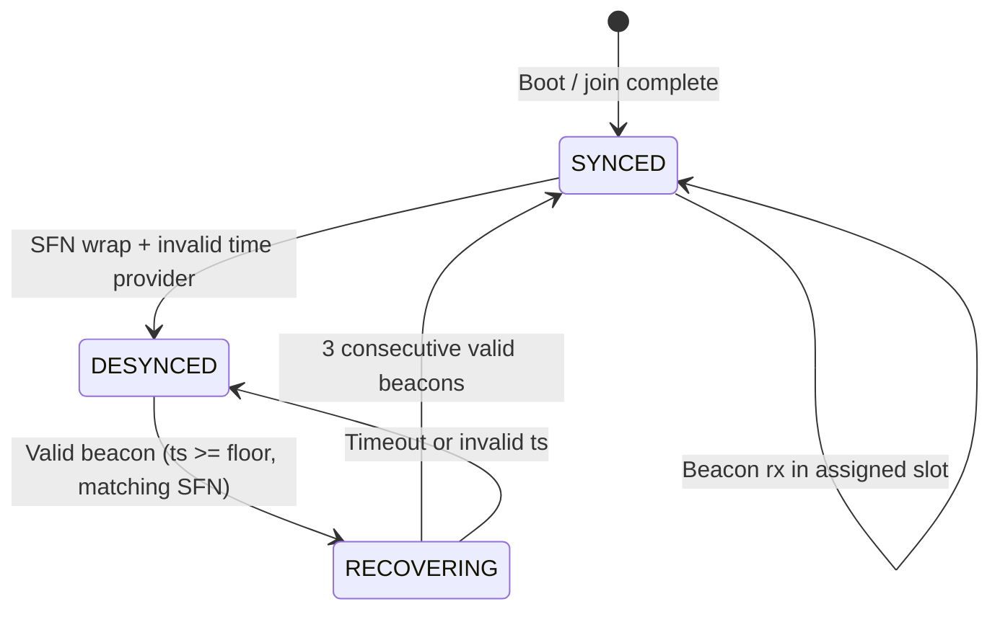
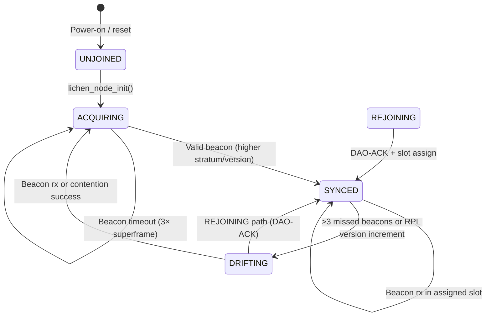

<!-- SPDX-License-Identifier: CC-BY-4.0 -->
<!-- SPDX-FileCopyrightText: The contributors to the LICHEN project -->

<!-- Part of LICHEN Protocol Specification -->

# Packets and Timing

## 13. Packet Formats

### 13.1. Complete Packet Example

**Scenario:** Leaf node sends CoAP temperature reading to border router.

**Application payload (CoAP):**
```
Ver=1, T=NON, TKL=1, Code=2.05 (Content)
Token: 0x42
Options: Content-Format=60 (CBOR)
Payload: {temperature: 23.5} -> A1 6B 74656D7065726174757265 F9 4DE0
         (16 bytes)
```

This exact example is plaintext CoAP. An OSCORE-protected message uses Rule 5
and has a different option and ciphertext tail, so its size is not included in
the arithmetic below.

**After SCHC compression (Rule 0):**
```
Rule 0 fixed header: Rule ID (1 byte) + octet-padded residue (22 bytes)
CoAP tail: token 0x42 (1 byte) + Content-Format option c1 3c (2 bytes)
           + payload marker ff (1 byte) + CBOR payload (16 bytes)
Total SCHC packet: 23 + 20 = 43 bytes
```

**With authenticated L2 payload dispatch:**
```
SCHC dispatch: 0x14 (1 byte)
SCHC packet: (43 bytes)
Total authenticated L2 payload: 44 bytes
```

**Link-layer frame:**
```
Length: 106 (0x6A, body bytes after Length)
LLSec: 0xA1 (SI + signature, no encryption, short addr) (1 byte)
Epoch: 0x01 (1 byte)
SeqNum: 0x0042 (2 bytes)
DstAddr: 0x0001 (border router short) (2 bytes)
Signer Identifier: canonical signer EUI-64 (8 bytes)
Payload: dispatch 0x14 + SCHC packet (44 bytes)
Signature: (48 bytes, Schnorr e₁₂₈+s)
Total: 107 bytes (Length byte plus 106-byte body)
```

**LoRa PHY:**
```
PHY payload: the complete 107-byte link frame
Radio overhead: 8-symbol preamble, explicit header, and PHY CRC; these are not
bytes inside the PHY payload
```

### 13.2. Packet Size Summary

| Layer | This Protocol | Meshtastic | MeshCore |
|-------|---------------|------------|----------|
| App payload | 16 | 17 | 17 |
| Security (E2E) | 0 (plaintext example) | 0* | 2 |
| Transport + Network | 27 | 16 | - |
| Routing/addressing overhead | 3 | 0-7 | 0-64 |
| Link security | 61 | 0 | 4 |
| **Total** | **107** | **33-40** | **23-87** |

*Meshtastic AES-CTR has no auth overhead; this is a weakness.

Link security breakdown: Length(1) + LLSec(1) + Epoch(1) + SeqNum(2) +
Signer Identifier EUI-64(8) + Signature(48) = 61 bytes (DstAddr and dispatch
are counted separately). Unsigned frames carry neither SIID nor MIC bytes.

### 13.3. RPL DIO Packet

```
Link-layer broadcast:
  [Len] [LLSec] [Epoch] [SeqNum] [Signer EUI-64] [Payload] [Sig]

IPv6/SCHC:
  [SCHC Rule 255] [complete validated IPv6/ICMPv6/DIO packet]
  destination inside IPv6 packet: ff02::1a (link-local all-RPL-nodes multicast)

ICMPv6:
  Type=155, Code=1 (DIO)

DIO payload:
  [RPLInstanceID] [Version] [Rank] [G/MOP/Prf] [DTSN]
  [Flags] [Reserved] [DODAGID]

Options:
  [Rule-Version: 13 01 03] [DODAG Configuration] [Prefix Information]
```

Rule 3 matches two `fe80::/64` endpoints and therefore MUST NOT encode the
multicast destination `ff02::1a`. A canonical multicast DIO uses sender-selected
Rule 255 and MUST pass the complete Rule 255 IPv6 validation, ICMPv6 checksum,
hop-limit, destination/scope, link-signature, signer/source binding, and exactly
one Rule-Version option checks before any parent-selection or routing mutation.
An absent, malformed, duplicate, or non-version-3 `13 01 vv` option is not
parent-selection admissible. A decoder MUST NOT reconstruct `fe80::1a` for this
packet.

---

## 14. Timing and Duty Cycle

### 14.1. Trickle Timer (DIO)

| Parameter | Value | Rationale |
|-----------|-------|-----------|
| Imin | 4 seconds | Allow network stabilization |
| Imax | 17 minutes | Reduce steady-state overhead |
| k | 10 | Suppress redundant DIOs |

### 14.2. DAO Timing

| Event | Delay |
|-------|-------|
| Initial DAO | Random 0-2 seconds after joining |
| DAO retry | 4, 8, 16 seconds (exponential backoff) |
| DAO refresh | 15 minutes (30-minute soft state lifetime / 2) |

Each new logical DAO, including a refresh or parent change, MUST advance its
64-bit DAO Origin Sequence, construct the complete signed DAO, and crash-safely
commit both the sequence and complete signed bytes before transmission. State
is keyed by the public key, not the full IPv6 address. Storage MUST provide
atomic commit or two independently validated slots with generation numbers.
The TX API MUST expose the retained complete bytes after reboot so a retry can
reuse the sequence only by retransmitting those bytes exactly; rebuilding or
re-signing an equal-sequence DAO is forbidden. The sequence starts above zero
and MUST NOT wrap; at `0xffffffffffffffff`, no new logical DAO may be sent.
Missing, corrupt, unavailable, or uncommitted state MUST stop DAO origination
until valid state above every value previously used with that key is restored.
A node MUST NOT fall back to a clock, random value, or link replay counter.

### 14.3. Data Traffic

| Traffic Type | Recommended Interval |
|--------------|---------------------|
| Periodic telemetry | 5-60 minutes |
| Event-driven | As needed |
| Heartbeat/keepalive | 30 minutes |

### 14.4. Duty Cycle Compliance

**EU 868 MHz (10% duty cycle):**

At SF9/125kHz, CR 4/5, an 8-symbol preamble, explicit header, and PHY CRC,
airtime for a 60-byte PHY payload is 369.664 ms.

Maximum whole packets per hour:
`floor(3600s * 0.10 / 0.369664s) = 973 packets`.

Per node, accounting for routing: ~100-300 packets/hour comfortable.

### 14.5. CSMA/CA Parameters

| Parameter | Value | Description |
|-----------|-------|-------------|
| CAD timeout | 3 symbols | Channel activity detection |
| Backoff unit | 10 ms | Slot time |
| Backoff max | 5 | CW = 2^backoff - 1 |
| Retry limit | 3 | Before reporting failure |

### 14.6. Time Synchronization

Accurate time is needed for replay protection, message TTL, SenML timestamps,
and scheduled operations. LICHEN firmware uses a unified time provider that
separates monotonic uptime from wall-clock time and validates all time sources
against epoch floors. See `docs/firmware-time-provider.md` for the full design.

**Time Provider Architecture:**

The firmware-wide time provider tracks:

- **Monotonic uptime:** Always available, used for age calculations and replay
  protection within a power cycle. Never synthesized into Unix time.
- **Wall-clock time:** Unix seconds, only valid after a trusted source provides
  a timestamp at or above the effective epoch floor.

Every candidate wall-clock sample MUST retain its source class and source name,
Unix time, monotonic observation time, freshness/age, source-specific validity,
policy decision, and available accuracy/quality metadata.  That provenance
MUST be immutable evidence issued at the provider or packet-verifier boundary;
callers MUST NOT promote self-asserted `authenticated`, `source_valid`, or
`policy_accepted` booleans into authoritative clock evidence.  A mesh sample
also MUST retain the authenticated peer identity, link replay counter, and the
exact authenticated option bytes.  The compact DIO Time Option does not carry
this provenance; receivers obtain it from the verified enclosing link/RPL
context and MUST fail closed when that context is missing or does not match the
candidate option.

An implementation MUST bind its LinkLayer receipt stamping, provider,
verifier, and authoritative tracker to one explicit monotonic-clock capability
and opaque clock-domain identity.  Construction MUST reject mismatched domains;
offset-compatible callables are not evidence that two clocks share an origin.
The capability MUST structurally retain its construction-time callback and
domain token: replacing either after construction MUST fail, rather than
preserving a trusted domain identity around attacker-controlled time.
The LinkLayer MUST accept that exact immutable monotonic-clock capability (or
the profile's exact system capability), derive its domain solely from that
object, and retain one immutable binding.  Bare callables, duck-typed clocks,
and caller-supplied domain overrides MUST be rejected.  Mutation of the bound
clock reference or cached domain MUST make receipt issuance and adopted network
time fail closed.
Creating a structurally similar sample, calling
a conventionally private constructor, or mutating public tracker fields MUST
NOT create valid-clock state.  A local provider capability is held only by the
corresponding GNSS, RTC, local-client, manual, NTS, or Roughtime integration.
The receiving LinkLayer MUST consume its exact, one-use receipt after signature
and replay acceptance and issue one sealed immutable authenticated-DIO result.
Time and SCHC-version consumers derive fixed evidence from that same result and
MUST NOT consume or parse the caller-visible receive object independently.

**Source Classes (by trust/precedence):**

| Class | Examples | Can Establish Wall Clock? |
|-------|----------|---------------------------|
| GNSS | On-device GNSS, external GNSS | Yes, if GNSS time-valid and timestamp >= epoch floor |
| Network | NTS (RFC 8915), Roughtime, SNTP, mesh peer DIO | Yes, only if authenticated **and** the signer/source is explicitly authorized for time, within accuracy policy, and >= floor |
| Local-client | Phone/app via LCI, gpsd | Yes, if policy permits and >= floor; stratum 4 additionally requires immutable, verified `gpsd` subtype and quality evidence |
| Manual/static | Provisioning tool, configuration | Yes, if policy permits and >= floor |
| Internal RTC | Retained RTC, external RTC chip | Yes, if initialized/valid and >= floor (accuracy degrades with age) |
| Monotonic | Uptime, cycle counter | No (ordering and age only) |

**Epoch Floor Validation:**

The effective epoch floor prevents stale or bogus timestamps from establishing
wall-clock time:

```
effective_epoch_floor = max(firmware_build_epoch, board_provision_epoch_if_valid)
```

Time samples below this floor are rejected for wall-clock establishment.
This guards against common failures: GNSS modules reporting their default
epoch (1980 or 1999), apps sending zero timestamps, or RTCs booting with
uninitialized values.

`board_provision_epoch_if_valid` means that verifier-issued metadata is
explicitly present, non-zero, authenticated or integrity-checked with the
board identity/settings, at or after the firmware build epoch, protected by a
non-rollback record version, and no farther ahead than a deterministic
deployment-configured provision lead bound.  A raw integer provision value is
non-authoritative and MUST NOT raise the floor.  Missing, malformed,
unauthenticated, rollback, earlier-than-build, or beyond-lead values MUST be
ignored, the firmware build epoch MUST remain the floor, and the rejection
reason MUST be observable.  An authenticated administrative path MUST be able
to replace or clear a rejected value so corrupt storage cannot permanently
prevent time establishment.

The provision verifier MUST compare the record's board identity/settings digest
with the expected local device identity, MUST load an explicit persistent
minimum record version, and MUST persist a newer accepted version before the
new provision floor becomes authoritative.  Merely carrying a non-empty board
identity or defaulting the minimum version to zero is insufficient.  Identity
mismatch, rollback, and persistence failure MUST be distinct diagnostics.
Replacement or clearing MUST require an administrative capability bound to the
provision verifier; clearing a record MUST NOT lower its rollback-version floor.

The canonical provision payload is `Board-Identity (32 octets) ||
Record-Version (uint64) || Epoch (uint32)`, with integers in network byte order.
The integrity verifier and administrative capability MUST authorize the exact
44-octet payload before installation.  Persistent rollback state MUST bind the
version to both the epoch and a digest of the complete canonical record.  An
equal version is acceptable only for the identical record; changed content
requires a strictly greater version.  Verification, persistent advancement,
in-memory commit, replacement, and clear MUST be atomic.  Persistence failure
MUST leave the previous state authoritative.  Clear MUST advance a revocation
generation so all previously issued metadata becomes invalid, and only a
successfully verified administrative install MAY leave the cleared state.
Clear MUST first persist a canonical inactive state that binds the retained
record version, epoch, complete-record digest, complete record, and non-empty
administrative reason.  Reboot from that state MUST retain the rollback floor
without restoring the cleared epoch as active.  Reactivating even the identical
record MUST persist an active rollback record before issuing metadata.  Caller
and persistence-hook objects are untrusted aliases: the verifier MUST retain
detached primitive snapshots and MUST fail closed if a hook mutates the value
it was asked to persist.  The persistent integrity verifier MUST authenticate
the complete canonical cleared-state encoding, not merely its embedded record.
Integrity and persistence hooks MUST be synchronous and non-reentrant.  An
implementation MUST reject and close an awaitable returned by a hook, and MUST
reject an install or clear that a hook attempts to invoke recursively.  The
outer transition MUST NOT commit when hook execution fails or re-enters.
No external integrity or persistence hook may run while the verifier holds a
lock needed by metadata, floor, tracker, or status reads.  Cross-thread
transition attempts made while such a hook is active MUST fail promptly and
taint the outer transaction; they MUST NOT wait behind the hook and deadlock.
Ordinary concurrent transitions MUST either serialize or fail before changing
state.
Epoch-floor evaluation MUST use verifier-owned primitive copies of the active
epoch, identity, version, and digest; it MUST NOT reread a caller-visible
metadata facade after validating that facade.
Record-Version is a canonical unsigned 64-bit integer; values above
`2^64-1` MUST be rejected before encoding.  Missing or corrupt rollback storage
MUST fail closed.  A first installation requires an explicit administratively
authorized virgin-store marker that was persisted before use.  Persistence
MUST return an exact storage acknowledgement for that marker; a no-op callback
is not persistence.  The administrative capability MUST mint at most one such
virgin state, and verifier construction MUST atomically consume it.  The state
MUST NOT be reusable or remintable, including across concurrent callers.
Record version zero MUST NOT be accepted.  Persistent rollback state MUST also
retain the canonical 44-octet record.  On reboot the verifier MUST authenticate
that record, recheck its board identity, digest, version, and epoch bindings,
and immediately restore the accepted floor; corrupt or mismatched restoration
MUST fail closed.

**Time Stratum (propagated in DIO Time Option):**

| Value | Meaning | Source Class |
|-------|---------|--------------|
| 0 | No sync | Monotonic counters only |
| 1 | Conservative synchronized | Network, Local-client, Manual/static, or Internal RTC |
| 2 | Roughtime | Network (BR) |
| 3 | NTS | Network (BR) |
| 4 | GNSS/gpsd | GNSS or Local-client |

Stratum identifies time quality; it does not authenticate a source and MUST NOT
be used to infer provenance.  In particular, a stratum-4 sample retains either
GNSS or Local-client/gpsd provenance and the corresponding policy.  A
Local-client claiming stratum 4 MUST carry an immutable `gpsd` subtype that its
bound provider verified.  Its canonical direct-source quality evidence MUST
include `gpsd_mode` equal to 2 or 3, `gpsd_time_valid` equal to true, and a
finite non-negative `gpsd_time_accuracy_seconds` no greater than the sample's
conservative accuracy claim.  Missing, malformed, time-invalid, or
over-claimed gpsd quality MUST be rejected.  A peer-DIO policy MAY explicitly
attest that an authorized stratum-4 peer represents a Local-client/gpsd origin;
that verifier-derived subtype is distinct from direct-provider gpsd evidence.
A non-gpsd Local-client MUST use stratum 1.
Every authoritative local sample MUST carry a non-zero stratum; valid wall
clock with stratum 0 is forbidden.  Direct manual, initialized retained-RTC,
and non-gpsd local-client samples use stratum 1 as the conservative local
synchronized quality while retaining their actual source class.  They MUST NOT
be relabeled as mesh provenance.  Direct NTS MUST use stratum 3, Roughtime MUST
use stratum 2, and authenticated SNTP uses stratum 3 in this profile.  A
protocol/stratum mismatch MUST be rejected.

**Project-local RPL Control Option Registry:**

LICHEN maintains this single registry for its provisional RPL Control Message
Option values:

| Type | Option | Normative definition |
|------|--------|----------------------|
| `0x12` | DAO Origin Signature | `05-routing.md` Section 6.4.3 |
| `0x13` | SCHC Rule Version | `03-adaptation.md` |
| `0x14` | Assigned SF | `02-physical-link.md` Section 3.4 |
| `0x15` | DIO Time | This section |
| `0x16` | DODAG Version Authorization | `05-routing.md` Section 8.4.1 |

These are collision-free project-local provisional values, not IANA
assignments.  No early-allocation request has been submitted.  An IANA
allocation that differs from this table MUST be applied atomically to every
specification, implementation, parser, and test vector before deployment.

**DIO Time Option (provisional Type 0x15):**

```
+--------+--------+--------+--------+--------+--------+
| Type   | Length | Stratum| Reserved| Timestamp (4B)  |
+--------+--------+--------+--------+--------+--------+
   1B       1B       1B       1B          4B (Unix epoch)
```

Type `0x15` is the project-local value in the registry above.  Implementations
MUST NOT encode this option as Type `0x00`: Pad1 is one octet and has no Length
field.

Length MUST be 6 and Reserved MUST be zero.  A sender with stratum 0 (No sync)
MUST encode Timestamp as zero; a receiver MUST reject a non-zero Timestamp at
stratum 0.  Strata 1 through 4 carry unsigned 32-bit Unix epoch seconds.

Nodes receiving a DIO with a higher stratum MAY adopt that time only after the
enclosing peer/link verifier authenticates the exact option **and** an explicit
time-source policy authorizes that authenticated signer for clock control.  The
structured provenance MUST agree with the advertised stratum, the source MUST
report valid time, its claimed accuracy MUST be no worse than the configured
maximum for that source class, and freshness and epoch checks MUST pass.
Authentication alone grants peer identity, not time authority.  Missing or
mismatched provenance, verification, authorization, or accuracy policy MUST
fail closed.  Nodes MUST NOT accept DIO timestamps below their effective epoch
floor.

The authenticated object is the complete parsed DIO, not a detached eight-byte
option or an arbitrary signed payload that happens to equal an option.  The
verifier MUST bind the exact Time Option byte span to the immutable signed DIO,
MUST reject a missing or duplicate Time Option, and MUST retain the enclosing
peer, replay counter, peer-key generation, receipt clock-domain identity, and
full authenticated IPv6 payload.  Because the compact
option does not encode origin provenance, an authorized root/peer policy MUST
map the signer and advertised stratum to the origin class.  Transport remains
Network while origin remains Network for strata 1--3 and GNSS or Local-client
for stratum 4; transport authentication MUST NOT erase that distinction.

The canonical authenticated link payload is the SCHC L2 dispatch (`0x14`)
followed by a SCHC-compressed IPv6 packet.  Its IPv6 Next Header MUST be ICMPv6;
the ICMPv6 message MUST have Type 155, Code 1, a checksum validated with the
decompressed IPv6 source/destination pseudoheader, and a canonical DIO body.
The sealed result MUST bind the expected RPLInstanceID, DODAGID, MOP, and
root/peer role and MUST retain exact option spans in the decompressed IPv6
packet. The decompressed link-local IPv6 source IID MUST equal the IID derived
from the authenticated link signer's full public key. For an expected root,
the DODAGID MUST additionally equal `AddrForKey(signer_public_key)`; a valid
signature never authorizes another key's source or root address. A verifier
MUST reject a bare DIO, another link dispatch, a malformed
SCHC packet, another IPv6 Next Header, a bad ICMPv6 checksum, another ICMPv6
type or RPL code, or a mismatched RPL/DODAG scope.  Link authentication MUST
issue an exact-object, owning-link, one-use receipt.  The receipt MUST carry an immutable monotonic
timestamp captured immediately after radio reception; no timing caller may
supply or replace it.  Parsing, detached extraction, and time-evidence issuance
MUST execute as one synchronous LinkLayer transaction under the link security
lock and MUST remain bound to the signer's current link-key generation.  The
callback input MUST be a fresh primitive snapshot reconstructed from
LinkLayer-owned issuance state, not from the caller-visible facade.  An
awaitable elevation callback MUST be closed and rejected.  Thus caller mutation
or concurrent key retirement cannot alter or issue usable time evidence.  The
one sealed DIO result MAY then fan out to the time and SCHC
version consumers without a second receipt or a second packet parse.  Before
either consumer reads a field, the owning LinkLayer MUST confirm the exact
issued object and a deep snapshot of its IPv6 bytes, DIO bytes, options/spans,
scope, signer/replay metadata, receipt time, clock domain, link identity, and
key generation.  Post-issuance mutation or evidence invalidated by key rotation
MUST fail closed.  Adoption MUST revalidate the signer and exact opaque
key-generation token in the same link-security transaction as the tracker
state commit.  Authoritative reads and status checks MUST invalidate already
adopted network time immediately when that generation is retired; retirement
of an unrelated signer or generation MUST NOT invalidate it.

An accepted sample is projected forward using monotonic elapsed time before a
correction is evaluated.  Implementations MUST enforce per-step correction
bounds and a cumulative forward-correction bound plus a configured correction
rate relative to an accepted monotonic/time anchor.  The anchor MUST survive
ordinary source expiry, explicit source invalidation, and source reselection;
those events MUST NOT restore the permissive initial-jump budget.  Resetting
the anchor requires an authenticated administrative recovery action, not
packet input.  Implementations MUST reject stale/replayed samples, implausible
initial or forward jumps, correction ratchets, and backward steps outside
explicit deployment policy.  A fresher equal-stratum sample MAY refresh or
correct the clock within those bounds.  A lower-stratum source MUST NOT
displace a valid current source, but MAY establish recovery after the current
source expires or is explicitly invalidated.  Rejection and invalidation
reasons SHOULD be exposed in provider diagnostics.
The correction-rate policy MUST be total for every constructible value.  This
profile caps it at 1,000,000 ppm; implementations MUST reject larger values and
MUST calculate the elapsed-time allowance without floating-point overflow.

The projected value, rather than the stale wire value, MUST be used for the
initial epoch-lead bound.  The provider MUST retain the raw sample for
provenance while exposing current time from an accepted
`(Unix-reference, monotonic-reference)` pair.  Authoritative reads MUST apply
source expiry even when no replacement sample arrives, and expiry MUST run
before candidate-specific rejection so an invalid candidate cannot keep an old
source valid.  Projection beyond the unsigned 32-bit DIO range MUST invalidate
DIO advertisement with an observable diagnostic rather than wrap.
The tracker MUST atomically claim each exact issuance and receive a detached
primitive snapshot from the issuing authority.  It MUST evaluate and adopt
only that snapshot; a separate validate-then-read sequence over a caller facade
is forbidden.  Mutating a previously submitted object or diagnostic copy MUST
NOT alter expiry, projection, evidence, or validity.  Every authoritative read and
transition MUST also re-evaluate the projected time against the live epoch
floor.  If a newly accepted provision raises the floor above the projected
clock, the tracker MUST atomically invalidate the source with a diagnostic.
Every adoption, DIO consideration, policy replacement, current-time read, and
status read MUST use one atomic floor snapshot/generation held stable through
its state commit.  A provision install or clear MUST NOT interleave between
floor validation and commit.  Each transition MUST invalidate a current source
that is below the live floor before evaluating its candidate.
Public epoch-floor helpers that receive provision metadata MUST require the
exact owning verifier and evaluate the exact live facade from verifier-owned
primitives in one verifier transaction.  Duck-typed `accepts()` objects and
validate-then-reread access to public metadata MUST NOT raise the authoritative
floor.  A concurrent install or clear may linearize before or after a read, but
the read MUST NOT combine stale validation with newer or caller-mutated data.

Direct NTS, Roughtime, authenticated SNTP, RTC, manual, and local-client samples
do not use a DIO receipt.  They MUST instead arrive through their bound provider
capability with source-specific authentication/validity metadata, and MUST pass
the same floor, freshness, accuracy, precedence, step, and cumulative policy as
peer-DIO samples.  Ordinary clear, expiry, and reselection retain the correction
anchor.  Resetting that anchor MUST require the tracker-bound administrative
capability and an auditable non-empty recovery reason.
Every provider/verifier issuance is one-use at the authoritative tracker:
first consideration consumes it even when policy, floor, freshness, option, or
step checks reject it.  For network samples, the replay barrier MUST advance
before comparing a separately supplied Time Option, so an option mismatch
cannot be retried with the same link counter.  Clear and automatic invalidation retain per-authority
issuance/replay high-water marks, so a pre-clear or previously considered
sample cannot restore validity; recovery requires fresh post-invalidation
issuance.  Clear MUST advance the issuance barrier for every bound authority,
including network verifiers, even when no network sample is currently active.
Network replay high-water advances on consideration, not only on successful
adoption.  Replay keys MUST retain stable opaque generation objects by identity
for their bounded lifetime; integer object addresses are not generation keys.

For Internal RTC, freshness is the immutable RTC age at observation plus
monotonic elapsed time since observation.  That accumulated age MUST be checked
at adoption, every authoritative read/transition, and policy replacement; the
configured maximum is inclusive at the exact boundary and exceeded immediately
after it.

Provider name, allowed source classes, policy, firmware-build floor, provision
verifier binding, and correction budgets MUST be immutable snapshots bound when
the tracker is constructed.  Packet or application callers MUST NOT select a
policy or raw epoch floor per adoption.  The floor authority MUST structurally
retain its construction-time firmware build epoch, provision-verifier identity,
and maximum lead while still observing valid live provision generations.
Policy replacement requires the exact
tracker-bound administrative capability and MUST immediately re-evaluate the
active source class, network peer authorization, accuracy, accumulated RTC age,
direct-gpsd validity, and freshness under
the replacement.  A now-disallowed active source MUST be invalidated while
correction anchors, references, and replay state are preserved; resetting those
requires the separate audited
administrative recovery transition.  Tracker reads and transitions, including
expiry, replay high-water checks, provision reads, clear, adoption, and status,
MUST be serialized.  Public authoritative reads MUST apply idle expiry and
projection before returning; unprojected samples are diagnostics only.
Every monotonic-clock callback and security/persistence elevation callback MUST
be synchronous.  Constructors MUST reject coroutine functions, and call sites
MUST close and reject any awaitable returned by a callable that concealed its
asynchronous behavior.  No wall-clock, provision, or tracker state may change
after such rejection.
A scheduled Task or Future MUST first be synchronously cancelled; coroutine
and custom closeable awaitables MUST be closed.  Implementations MUST verify
cancellation or termination where the local runtime can do so before reporting
the rejected transition.

Scalar helpers that consider only source, stratum, timestamp, or epoch floor
are non-authoritative prefilters.  They MUST NOT be exposed as the primary
clock-adoption API, and a positive scalar result MUST NOT update wall-clock
state without the structured verifier/provider evidence and policy checks
above.

**Constrained Node Behavior:**

Nodes without a valid wall-clock source:
- Use link sequence numbers for replay protection within a power cycle; the
  DAO Origin Sequence in Section 14.2 remains persistent across power cycles
- SHOULD persist replay epoch counter across reboots (increment on boot)
- MAY omit absolute timestamps from SenML (use relative `t` offsets only)
- MUST NOT originate time-sensitive operations (scheduled check-in, message
  TTL that requires wall-clock comparison)
- Report `wall_clock_valid=false` via LCI status until a valid source appears

**Border Router Responsibilities:**

Border routers with internet connectivity SHOULD:
- Run NTS client (preferred) or Roughtime client
- Validate obtained time against the epoch floor before advertising
- Advertise time in DIO with appropriate stratum
- Provide NTS/Roughtime proxy for LCI clients
- Expose time provider state (source class, validity, age) via CoAP status

### 14.7. TDMA Superframe Number (SFN)

All nodes in a DODAG MUST compute TDMA slot assignments using identical hash
function and modulo semantics as defined in 02a-coordinated-capacity.md §2a.2 (see also
Section 4.5 of this document for hash-based self-assignment precedent using
hash_32). Nodes MUST NOT use implementation-specific variations. Slot index
is computed as `slot = u32(hash_32(eui64) + u32(sfn)) mod num_slots`
(exact per is_assigned_slot pseudocode and ccp_load_balancing.json).

**Time-Provider Interaction on SFN Wrap:**

```pseudocode
// on_sfn_wrap(beacon): see docs/firmware-time-provider.md:23 for
// effective_epoch_floor definition and lichen_hal_time_submit()
on_sfn_wrap(beacon):
    ts = beacon.timestamp
    if not time_provider.validate(ts >= effective_epoch_floor
                                  and wall_clock_valid):
        enter_desync_recovery()
        return
    update_local_sfn(ts, beacon.sfn)
    remain_synced()
```

Nodes MUST reject SFN updates unless the timestamp passes the time provider's
effective epoch floor validation (see docs/firmware-time-provider.md:56 for
rejection semantics). This interaction prevents wrap-induced desynchronization
from stale or bogus time.

**Desynchronization Recovery FSM:**

The recovery mechanism is a finite state machine (see 02a-coordinated-capacity.md §2a.2.1 through §2a.2.3 for SFN definition and slot/hash assignment, and §2a.5 for desync recovery FSM) for full normative definition, timing parameters, and test vectors. States and transitions:

| Current State | Event | Next State | Action |
|---------------|-------|------------|--------|
| SYNCED | SFN wrap + invalid time provider | DESYNCED | Suppress TDMA TX, use contention only |
| DESYNCED | Valid beacon (ts >= floor, matching SFN) | RECOVERING | Start extended listen timer |
| RECOVERING | 3 consecutive valid beacons | SYNCED | Resume normal TDMA slot usage |
| RECOVERING | Timeout or invalid ts | DESYNCED | Reset listen window |



*Figure 1: Desynchronization Recovery State Machine. See table above for exact conditions and actions.*

Implementations MUST implement this FSM in the TDMA subsystem (lichen_tdma_init()
in lichen/subsys/lichen/link) and document timeout values (RECOMMENDED: 3
superframes for RECOVERING).

---

High-density deployments risk boot storms when many nodes power up simultaneously and transmit before Trickle or CSMA/CA stabilizes the channel. Nodes MUST implement density-aware startup to mitigate this.

**Constants:**

| Constant          | Value     | Rationale                          |
|-------------------|-----------|------------------------------------|
| LISTEN_PERIOD_MIN | 30 s      | Minimum passive listen time        |
| LISTEN_PERIOD_MAX | 60 s      | Maximum passive listen time        |
| DELAY_PER_NODE    | 5 s/node  | Scaling factor per observed node   |
| MAX_STARTUP_DELAY | 300 s     | Upper bound on computed delay      |

**Normative Boot Behavior:**

1. On boot, node MUST listen-only for random duration chosen uniformly from [LISTEN_PERIOD_MIN, LISTEN_PERIOD_MAX].
2. During listen period, MUST count unique nodes heard (deduplicated by EUI-64/short address from announces, DIOs, DIS, and valid frames).
3. Compute `initial_delay = min(MAX_STARTUP_DELAY, nodes_heard * DELAY_PER_NODE)`.
4. MUST then delay by random(0, initial_delay) before first transmission.
5. Scaled delay MUST apply to first announce, first DIO, and first DIS.

**Additional Requirements (MUST):**
- Listen before transmitting on initial boot.
- Scale initial TX delay by observed network density.
- MAY shorten listen to LISTEN_PERIOD_MIN if channel idle (no packets for first 15 s).

### 14.8. TDMA Time Slots and Coordinated Capacity FSM (CCP-1.2)

Superframe: beacon slot (gateway TX), N data slots (assigned node TX only),
contention slot (CSMA/CA for joins, retries, legacy). Guard time is 50 ms. At
each configured data rate, slot duration MUST be at least
`ceil(maximum permitted PHY-payload airtime in milliseconds) + 50 ms`; it is
not derived from a typical packet. For the 255-byte profile maximum at
SF10/125 kHz, CR 4/5, an 8-symbol preamble, explicit header, and PHY CRC, the
airtime is 2,295.808 ms and the minimum slot is 2,346 ms.
The data window begins at the slot boundary and ends before the single trailing
50 ms guard. Nodes MUST NOT transmit during the guard.

Assignment: canonical rotating `(hash_32(EUI64) + u32(SFN)) mod N` or an explicit dynamic assignment via DIO/beacon; node confirms via DAO. Beacon carries SFN, slot bitmap, next-beacon time (see routing dispatch).

**SFN Modulo and Time-Provider Interaction:**

SFN is a 32-bit unsigned counter. Delta computation between current and last SFN MUST use unsigned 32-bit arithmetic (modulo 2^32 semantics) to correctly handle boundary at 0xFFFFFFFF:

```
SFN_delta(curr, last) = (curr - last) mod 2^32
```

(with unsigned modular arithmetic: curr=0, last=0xFFFFFFFF yields delta=1). Implementations MUST compute this using language-native unsigned 32-bit subtraction or equivalent.

The computation MUST anchor to the time-provider `effective_epoch_floor` (Section 14.6; `docs/firmware-time-provider.md`; Time Stratum and DIO Time Option). SFN derivation or validation from wall-clock time MUST only use samples where `wall_clock_valid=true` and `unix_time >= effective_epoch_floor`. Nodes MUST reject SFN updates derived from timestamps failing epoch_floor validation. This interaction prevents desynchronization from stale GNSS/RTC/network time and ensures consistent slotting across reboots and stratum changes.

All SFN edge cases including wraparound, desynchronization recovery FSM transitions, multi-root beacon conflicts, and RPL version changes during join/drift MUST be covered by test vectors (see `test/vectors/ccp16.json`, `ccp_tdma.json`). See spec/02a-coordinated-capacity.md §2a.2 and §2a.5 for full normative FSM table.

**FSM for desync/rejoin robustness:** See
`spec/02a-coordinated-capacity.md` §2a.2 and §2a.5 for the complete
normative FSM. Before a node enables assigned-slot transmission it MUST have a
usable authenticated link identity and current replay state, an initialized
RPL/DODAG context, and the time/SFN state required by this section. Platform
initialization order and function names are implementation details, not wire
protocol requirements. Rejoin timeout is 10 × superframe length.



*Figure 2: Desync/Rejoin Robustness FSM. See table below for full event conditions, timers, and actions.*

| Current State | Event/Condition | Timer/Timeout | Action | Next State | Reference |
|---------------|-----------------|---------------|--------|------------|-----------|
| UNJOINED | Power-on / reset | - | Initialize link identity, replay, routing, and time/SFN state | ACQUIRING | This section; `spec/02a-coordinated-capacity.md` §2a.2 |
| ACQUIRING | Valid beacon (signature verified, higher stratum/version) | BEACON_TIMEOUT = 3×superframe | Sync SFN, adopt time, and confirm the assignment by DAO | SYNCED | Sections 14.6 and 14.8 |
| SYNCED | Beacon rx in assigned slot | superframe_timer | TX in slot, update RPL | SYNCED | 50 ms guard enforced per Section 14.8 |
| SYNCED | >3 missed beacons or RPL version increment | rejoin_timeout=10*superframe_len | Reset SFN, clear stale state | DRIFTING | desync recovery |
| DRIFTING | Valid beacon (signature verified, stratum >= current root stratum) | REJOIN_TIMEOUT | Re-enter DODAG acquisition under the authenticated root policy | ACQUIRING | `spec/02a-coordinated-capacity.md` §2a.5 |
| DRIFTING | Valid beacon (signature fail or stratum < current) | REJOIN_TIMEOUT | Silently discard; continue listen | DRIFTING | signature fail MUST be discarded |
| REJOINING | DAO-ACK + slot assign | - | Enter assigned slot and report local-client status | SYNCED | Section 14.8 |

MUST reset all timers on state transition. All transitions and multi-root cases produce identical test vector output. See `test/vectors/` (updated for FSM/multi-root) and full init graph in AGENTS.md (normative where referenced).

Legacy nodes ignore unknown frames, use contention slot only. Mixed networks compatible.

---
[← Previous: Node Types](08-nodes.md) | [Index](README.md) | [Next: Implementation →](10-implementation.md)
